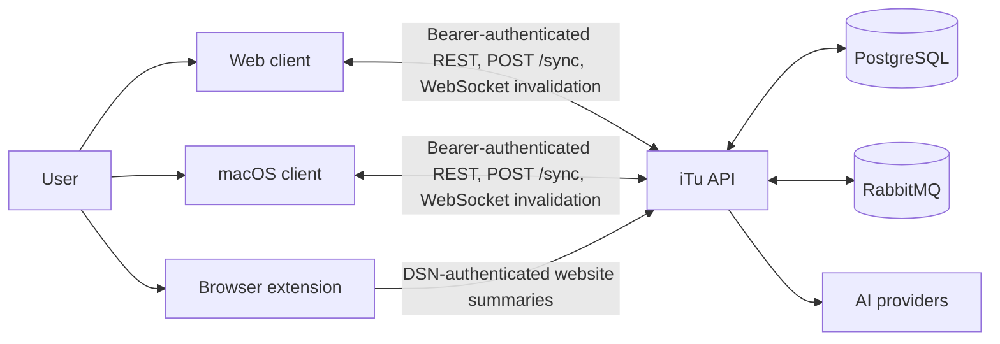
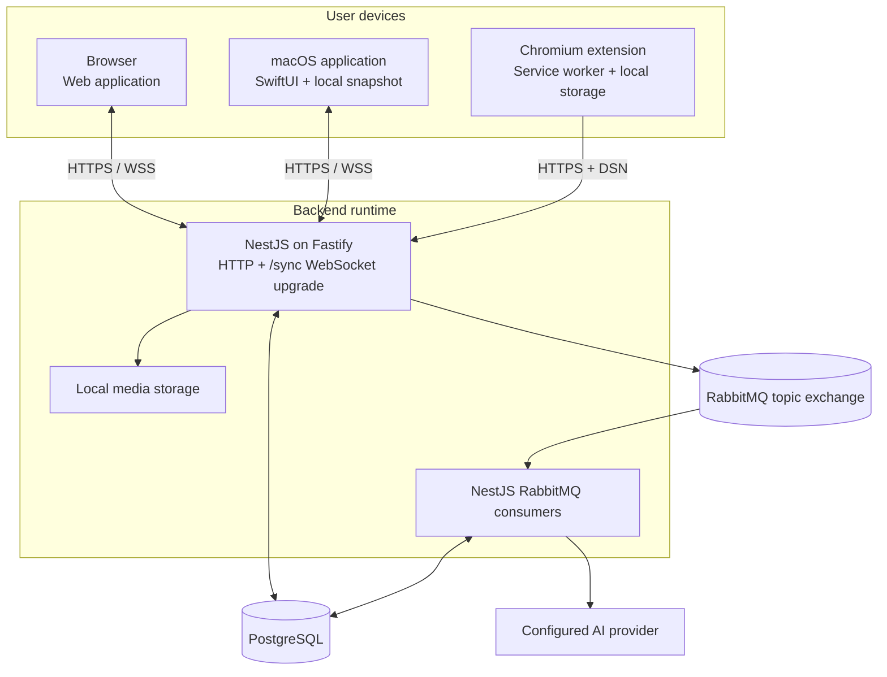
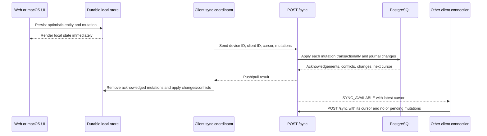
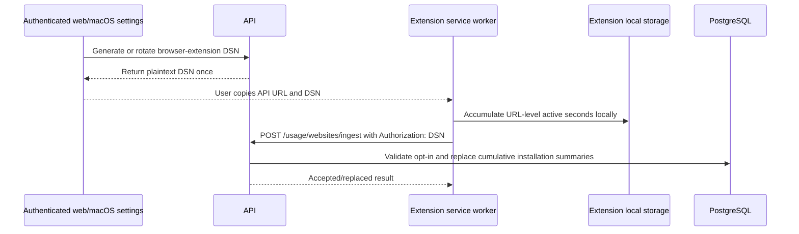

# iTu Architecture

This directory is the start-here architecture guide for engineers joining iTu. It describes the current workspace: a shared API, two authenticated clients, and an opt-in browser extension.

Read this page first, then follow the component involved in your change:

1. [API](api.md) for business rules, persistence, synchronization, and jobs.
2. [Web](web.md) for React features, browser state, and offline-first synchronization.
3. [macOS](macos.md) for SwiftUI features, native persistence, synchronization, and platform integrations.
4. [Browser extension](extension.md) for website-usage collection and DSN-authenticated ingestion.

For product terms, use the [ubiquitous language](../ubiquitous_language.md). For setup and operational commands, use the repository [README](../../README.md). Verified native gaps live in the [macOS roadmap](../../macos/ROADMAP.md), not in these guides.

## Workspace structure

```text
api/                     NestJS/Fastify API, business rules, Prisma, jobs
web/                     React/Vite web client and browser-local sync state
macos/                   SwiftUI client, native persistence and integrations
extension/               Manifest V3 browser activity extension
agent_docs/              Durable project and contributor documentation
  architectures/         This onboarding guide
```

The component directories are separate repository boundaries inside the workspace. Treat unrelated local changes as user-owned.

## Current feature map

This table records implemented surfaces visible in the current workspace. A surface in both clients does not imply identical depth; the [macOS roadmap](../../macos/ROADMAP.md) remains the native parity source.

| Product area | API capability | Web surface | macOS surface | Extension role |
| --- | --- | --- | --- | --- |
| Account | Registration, login, refresh, Google OAuth, profile, password, export, deletion | Authentication and profile/settings | Authentication and profile/settings | None |
| Planning | Projects, Sections, Tasks, Subtasks, Tags, reminders, recurrence metadata, ordering, Trash | Today, Plan, Inbox, Upcoming, Eisenhower Matrix, Trash | Home, Today, Inbox, Upcoming, Completed, Planning, Eisenhower Matrix, Trash | None |
| Focus | Presets, sessions, events, history, sounds, task/Habit linkage | Focus workspace and global timer | Focus workspace and menu-bar controls | None |
| Habits | Schedules, occurrences, check-ins, progress, commitments, statistics | Habit journal, progress, history, and settings | Habits, progress, history, and settings | None |
| Learning | Flashcard Decks, Flashcards, scheduling, Study Sessions, review history, imports | Decks, review, Learning History | Learn, Decks, review, and history | None |
| AI learning helpers | Card Suggestions and Study Feedback jobs | AI-assisted learning actions | Uses shared API capabilities where surfaced | None |
| Growth | Attributes, Skills, mappings, earning rules, Account/Skill XP, Coins, Shop Items, Inventory, ledger, resets | Attributes, Skills, Shop, ledger, receipts | Growth overview, shop/inventory, ledger, and settings | None |
| Journal | Entries, tags, templates, attachments | Journal workspace and weekly views | Journal surface | None |
| Budget | Categories, periods, transactions, overview | Budget overview, transactions, budgets, calendar | Budget surface | None |
| Gym | Exercise definitions, workouts, images, history, statistics | Gym overview, active workouts, exercises, history | Gym surface | None |
| Statistics and usage | Dashboard statistics, app/website usage summaries, retention, deletion | Statistics and tracking settings | Statistics plus foreground-app collection | Active URL collection and upload |
| Device coordination | Sync Device registration, cursor sync, conflicts, invalidation | IndexedDB offline sync and conflict handling | Native offline sync and conflicts | None |

The guides below explain how these features are partitioned rather than repeating their product behavior.

## System context



The API is the cross-device authority. Web and macOS can make supported changes locally first, then push mutations and pull authoritative changes. The extension is not a sync client: it uploads cumulative website-usage summaries through a restricted DSN credential.

## Runtime topology



HTTP and RabbitMQ consumers run in one hybrid NestJS application when `RABBITMQ_URL` is configured. PostgreSQL stores user data, sync journals, device cursors, job state, and usage summaries.

## Ownership map

| Concern | API | Web | macOS | Extension |
| --- | --- | --- | --- | --- |
| Business and authorization rules | Authoritative | Presents results | Presents results | None |
| Primary UI | None | React feature areas | Native SwiftUI features | Tracking settings and local summary popup |
| Local durability | None | IndexedDB outbox, cache, conflicts, lease | Atomic JSON snapshot and outbox | Extension local storage totals/settings |
| Cross-device synchronization | Applies mutations, journals changes, emits invalidations | Push/pull client and cross-tab coordination | Push/pull client | Not a sync participant |
| Authentication | Access tokens, refresh cookie/session, OAuth | Access token in memory; refresh cookie | Access and refresh session cache | Rotatable DSN limited to ingestion |
| Platform tracking | Stores and reports summaries | Reads reports and manages preferences/DSN | Collects foreground-app usage | Collects active HTTP(S) tab usage |
| Background work | Publishes and consumes RabbitMQ jobs | None | Native timers/observers only | Browser alarm-driven upload |

The matrix describes ownership, not feature parity. Consult the macOS roadmap for current native coverage.

## Offline mutation and cross-device refresh



`SYNC_AVAILABLE` is an invalidation, not the data itself. A receiving client still pulls changes through `POST /sync`.

## Browser-usage ingestion



The DSN is distinct from a user login token and is accepted only by the browser-extension ingestion endpoint.

## Tracing a change

Start from the client feature, identify whether it uses direct REST or the offline mutation path, then follow the matching controller into an application service and repository port. For synchronized entities, also inspect the client cache reconciliation and the API sync mutation handler. The component guides link to representative entry points for each step.
