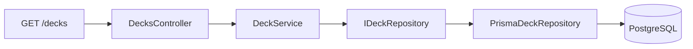
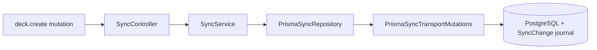
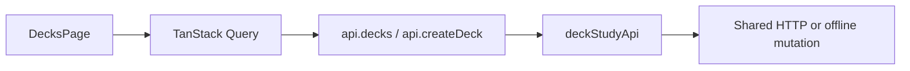
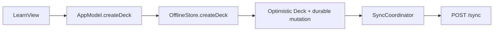

# Codebase Learning Walkthrough

This walkthrough is for engineers who are new to TypeScript, NestJS, React, Swift, or SwiftUI. Follow one representative feature—**Flashcard Decks**—through all three applications before studying the larger Planning, Growth, or synchronization modules.

[Back to the architecture overview](README.md)

## The representative feature

Flashcard Decks are a useful learning slice because they demonstrate:

- NestJS module, controller, service, port, and persistence boundaries.
- React routing, components, state, queries, mutations, and API composition.
- SwiftUI views, shared observable state, actor-based persistence, and native synchronization.
- The difference between direct REST reads and offline-first mutations.

## API: NestJS and TypeScript

Read these files in order:

1. [`main.ts`](../../api/src/main.ts) starts NestJS/Fastify and configures middleware, validation, security, logging, WebSockets, and RabbitMQ.
2. [`app.module.ts`](../../api/src/app.module.ts) is the backend table of contents. It composes the feature and infrastructure modules.
3. [`decks.module.ts`](../../api/src/features/decks/decks.module.ts) is a small representative NestJS module: it imports dependencies, registers a controller and service, and exports the service.
4. [`decks.controller.ts`](../../api/src/infrastructure/transport/rest/controllers/decks.controller.ts) shows routes, decorators, authentication, request data, and delegation to application code.
5. [`deck.service.ts`](../../api/src/core/application/use-cases/deck.service.ts) shows business rules, not-found handling, default-deck protection, repository calls, and study-stat aggregation.
6. [`deck-use-case.port.ts`](../../api/src/core/application/ports/in/deck-use-case.port.ts) defines commands, results, and the use-case interface.
7. [`persistence.module.ts`](../../api/src/infrastructure/persistence/persistence.module.ts) shows dependency injection: services request repository tokens and NestJS supplies Prisma implementations.

### Ordinary read flow

The controller owns HTTP concerns, the service owns application decisions, the port defines what persistence must provide, and the Prisma repository implements it.

### Offline mutation flow

The current clients normally create or edit Flashcard Decks through synchronization rather than the direct controller mutation endpoint:

Read this path after the ordinary controller/service flow:

- [`sync.controller.ts`](../../api/src/infrastructure/transport/rest/controllers/sync.controller.ts)
- [`sync.service.ts`](../../api/src/core/application/use-cases/sync.service.ts)
- [`prisma-sync.repository.ts`](../../api/src/infrastructure/persistence/prisma/prisma-sync.repository.ts)
- [`prisma-sync-transport-mutations.ts`](../../api/src/infrastructure/persistence/prisma/prisma-sync-transport-mutations.ts)

### Concepts to recognize

- TypeScript imports, interfaces, generics, and `async`/`await`.
- NestJS decorators such as `@Module`, `@Controller`, `@Get`, and `@Inject`.
- Controllers as transport adapters and injectable services as application behavior.
- Dependency-injection tokens connecting ports to infrastructure implementations.
- Exceptions traveling back through the global exception filter.

The official [NestJS documentation](https://docs.nestjs.com/) covers modules, controllers, providers, guards, pipes, and dependency injection.

## Web: React and TypeScript

Read these files in order:

1. [`main.tsx`](../../web/src/main.tsx) starts React and composes the query, authentication, synchronization, theme, undo, and routing providers.
2. [`App.tsx`](../../web/src/App.tsx) shows protected routing, redirects, the shared layout, and feature entry points.
3. [`DecksPage.tsx`](../../web/src/features/decks/DecksPage.tsx) is a representative page with components, local state, forms, queries, mutations, loading, errors, empty states, and cache updates.
4. [`deckStudyApi.ts`](../../web/src/shared/api/deckStudyApi.ts) turns UI operations into typed REST requests or offline mutations.
5. [`client.ts`](../../web/src/shared/api/client.ts) assembles endpoint groups behind the shared API facade.

### Page and API flow

`useState` owns form and interaction state. TanStack Query owns server state. The shared API facade prevents feature pages from implementing authentication or synchronization themselves.

### Offline-first files

After the page makes sense, read:

- [`SyncProvider.tsx`](../../web/src/shared/sync/SyncProvider.tsx) to see React, authentication, TanStack Query, and synchronization connected.
- [`syncQueue.ts`](../../web/src/shared/sync/syncQueue.ts) for outbox flushing, retry state, the cross-tab lease, and BroadcastChannel coordination.
- [`offlineStore.ts`](../../web/src/shared/sync/offlineStore.ts) for IndexedDB durability.
- [`syncCache.ts`](../../web/src/shared/sync/syncCache.ts) for applying authoritative server changes to TanStack Query.

### Concepts to recognize

- Function components and JSX/TSX.
- Props for parent-to-child input.
- `useState` for local memory and `useEffect` for external-system synchronization.
- Context providers for application-wide dependencies.
- TanStack Query queries, mutations, cache keys, invalidation, and optimistic results.
- Conditional rendering for loading, error, empty, and populated states.

Use the official [React Learn guide](https://react.dev/learn) and [Hooks reference](https://react.dev/reference/react/hooks) as primers.

## macOS: Swift and SwiftUI

Read these files in order:

1. [`iTuApp.swift`](../../macos/iTu/App/iTuApp.swift) is the `@main` entry point. It creates application scenes and injects shared state.
2. [`RootView.swift`](../../macos/iTu/App/RootView.swift) derives loading, authentication, and main-app presentation from `AppModel`.
3. [`MainView.swift`](../../macos/iTu/Features/Shell/MainView.swift) shows navigation, responsive layout, environment state, and view composition.
4. [`LearnView.swift`](../../macos/iTu/Features/Learn/LearnView.swift) contains the native Flashcard Deck and study UI.
5. [`AppModel+LearnDecks.swift`](../../macos/iTu/App/AppModel+LearnDecks.swift) bridges SwiftUI actions to API and offline-store operations.
6. [`OfflineStore+LearnDecks.swift`](../../macos/iTu/Shared/Persistence/OfflineStore+LearnDecks.swift) updates optimistic models, appends mutations, and persists the snapshot atomically.

### Native write flow

Then read:

- [`SyncCoordinator.swift`](../../macos/iTu/Shared/Sync/SyncCoordinator.swift) for outbox scheduling, retries, Sync Device registration, WebSocket invalidation, and reconciliation.
- [`APIClient.swift`](../../macos/iTu/Shared/API/APIClient.swift) for authenticated REST transport.
- [`OfflineStore.swift`](../../macos/iTu/Shared/Persistence/OfflineStore.swift) for actor-isolated snapshot persistence.

### Concepts to recognize

- Swift structs, classes, protocols, enums, optionals, and extensions.
- `async`/`await`, actors, and `@MainActor` isolation.
- SwiftUI `App`, `Scene`, `View`, `@State`, `@Environment`, and bindings.
- Declarative rendering: views describe current state rather than manually changing controls.
- `AppModel` as shared observable state and `OfflineStore` as durable actor-isolated state.
- AppKit integration for behavior that SwiftUI does not own directly.

Apple's [SwiftUI App documentation](https://developer.apple.com/documentation/swiftui/app) introduces the entry point and shared-state model used here.

## Suggested learning order

1. Trace `GET /decks` from `DecksPage` or `LearnView` to PostgreSQL.
2. Trace `deck.create` from the client’s optimistic update through `POST /sync`.
3. Add a debugger breakpoint or temporary local observation at each boundary; do not change behavior yet.
4. Read the relevant tests beside each layer to see intended outcomes and edge cases.
5. Only then move to Planning, Growth, or the central synchronization repository.

## Avoid starting here

Do not begin with these files unless you already understand the Deck flow:

- `prisma-sync.repository.ts`
- Growth award and persistence code
- Planning/Task synchronization handlers
- `AppModel.swift`
- `SyncProvider.tsx`

They combine many concepts and product rules. The Flashcard Deck slice teaches the project’s basic grammar with fewer moving parts.
