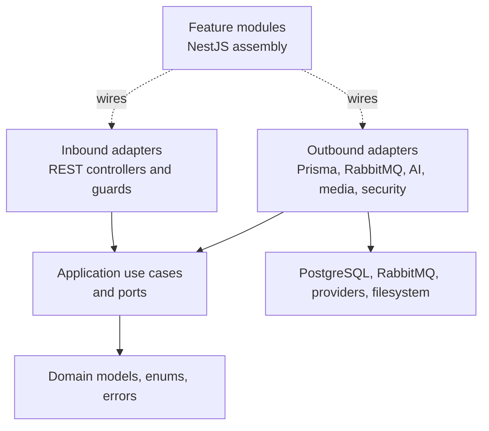
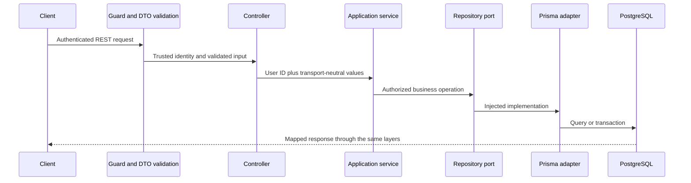
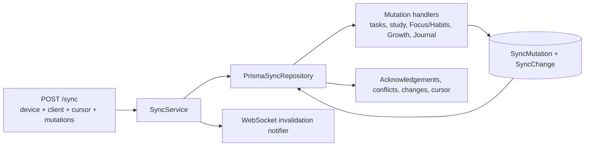
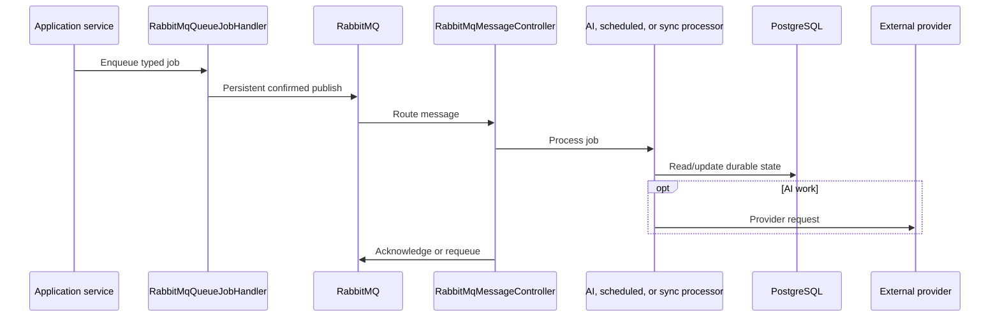

# API Architecture

The API is a NestJS application using Fastify for HTTP, Prisma for PostgreSQL, and RabbitMQ for durable background jobs. Its central constraint is inward dependency direction: domain and application code do not depend on transport or persistence implementations.

[Back to system overview](README.md)

## Structure and dependency direction

```text
api/src/
  core/domain/                 Models, enums, domain errors
  core/application/
    use-cases/                 Business workflows and rules
    ports/in/                  Use-case contracts
    ports/out/                 Repository and service contracts
    constants/                Shared application constants and tokens
  features/                    NestJS module assembly by product area
  infrastructure/
    transport/rest/            Controllers, DTOs, guards, response types
    persistence/prisma/        Prisma service, repositories, sync handlers
    queue/                     RabbitMQ publisher, consumers, processors
    sync/                      WebSocket invalidation adapter
    security/                  Password hashing, JWT, Google OAuth
    ai/                        AI provider adapters
    media/                     Media storage adapter
    logging/                   Request context, sanitization, Winston
```



The dashed lines are dependency injection and module assembly. Application code calls ports; infrastructure implements them.

## Current feature modules

[`app.module.ts`](../../api/src/app.module.ts) currently assembles these API capabilities:

| Module | Current responsibility |
| --- | --- |
| `AuthModule` | Account registration, login, refresh/logout, profile, password, Google OAuth, export, and deletion |
| `DecksModule`, `CardsModule`, `StudyModule` | Flashcard Decks, Flashcards, imports, review scheduling, Study Sessions, and history |
| `AiModule` | Card Suggestions and Study Feedback submission/processing |
| `ProductivityModule` | Projects, Sections, Tasks, reminders, notifications, Focus, Habits, and their statistics |
| `GrowthModule` | Growth Profile, Attributes, Skills, mappings, earning rules, awards, Shop Items, Inventory, ledger, and resets |
| `JournalModule` | Journal Entries, tags, templates, attachments, and weekly summaries |
| `BudgetModule` | Budget categories, periods, transactions, and overview |
| `GymModule` | Exercise definitions, images, workouts, completion, history, and statistics |
| `DashboardModule` | Cross-feature summaries and study calendar/statistics |
| `UsageModule` | Foreground-app and website usage summaries, DSN generation/ingestion, retention, and deletion |
| `SyncModule`, `DevicesModule` | Sync Device registration, mutation push/pull, cursors, conflicts, and invalidation |
| `TrashModule` | Recoverable deletion, restoration, and permanent deletion |
| Infrastructure media/public modules | Authenticated uploads and static built-in media/audio delivery |

These modules describe transport/assembly ownership. Business rules still live in application services and persistence remains behind ports.

## Bootstrap and feature assembly

[`main.ts`](../../api/src/main.ts) creates the Fastify application, installs cookies, compression, multipart handling, CORS, security headers, logging, and optionally attaches the RabbitMQ microservice. [`app.module.ts`](../../api/src/app.module.ts) assembles product feature modules and global validation/error mapping.

Feature modules such as [`sync.module.ts`](../../api/src/features/sync/sync.module.ts) bind controllers and use cases to shared infrastructure modules. They should contain wiring, not duplicate business rules.

## Ordinary request flow



Controllers translate HTTP concerns. Application services own authorization and business decisions. Prisma adapters own persistence details and mapping.

Representative entry points:

- [`auth.controller.ts`](../../api/src/infrastructure/transport/rest/controllers/auth.controller.ts) and [`auth.service.ts`](../../api/src/core/application/use-cases/auth.service.ts) for login/session flow.
- [`productivity.controller.ts`](../../api/src/infrastructure/transport/rest/controllers/productivity.controller.ts) for planning, Focus, and Habit transport.
- [`persistence.module.ts`](../../api/src/infrastructure/persistence/persistence.module.ts) for repository bindings.
- [`prisma.repositories.ts`](../../api/src/infrastructure/persistence/prisma/prisma.repositories.ts) for shared repository implementations.

## Synchronization

[`sync.controller.ts`](../../api/src/infrastructure/transport/rest/controllers/sync.controller.ts) exposes one authenticated push-then-pull operation. [`sync.service.ts`](../../api/src/core/application/use-cases/sync.service.ts) coordinates mutation application, job enqueueing, cursor pulls, device updates, and peer invalidation.



[`prisma-sync.repository.ts`](../../api/src/infrastructure/persistence/prisma/prisma-sync.repository.ts) is the persistence facade. It provides idempotency by storing mutation IDs, applies mutations transactionally, records conflicts, and serves either an initial snapshot or incremental journal changes. Specialized mutation handlers keep the facade from owning every product rule.

[`websocket-sync-invalidation.notifier.ts`](../../api/src/infrastructure/sync/websocket-sync-invalidation.notifier.ts) authenticates `/sync` upgrades with an access token plus device/client identity. It notifies every matching connection except the exact origin client. It does not transmit changed entities.

## Background jobs



The publisher and consumer run in the same process but communicate through RabbitMQ. See [`queue.module.ts`](../../api/src/infrastructure/queue/queue.module.ts), [`rabbitmq-queue-job.handler.ts`](../../api/src/infrastructure/queue/rabbitmq-queue-job.handler.ts), and [`rabbitmq-message.controller.ts`](../../api/src/infrastructure/queue/rabbitmq-message.controller.ts).

## Usage and extension boundary

Authenticated clients manage tracking preferences, read summaries, and upload macOS device summaries through [`usage.controller.ts`](../../api/src/infrastructure/transport/rest/controllers/usage.controller.ts). The extension uses only `POST /usage/websites/ingest`, protected by [`browser-extension-dsn.guard.ts`](../../api/src/infrastructure/transport/rest/guards/browser-extension-dsn.guard.ts). [`usage.service.ts`](../../api/src/core/application/use-cases/usage.service.ts) validates ranges, ownership, opt-in state, normalization, and retention semantics.

## Architectural invariants

- Keep domain/application production code independent of NestJS controllers and Prisma client types.
- Validate untrusted input at transport boundaries, then pass explicit identity into use cases.
- Enforce user ownership and business rules before persistence changes.
- Use transactions for multi-record state changes and idempotency for retryable operations.
- Treat sync cursors as opaque client values even though the current server implementation uses increasing integers.
- Send data through `POST /sync`; use WebSockets only to signal that a pull is needed.
- Store only hashed browser-extension DSN credentials and restrict them to ingestion.
- Keep sensitive bodies and credentials out of logs through the logging sanitizer.
