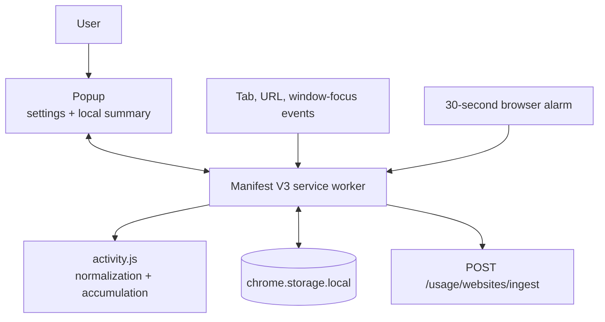
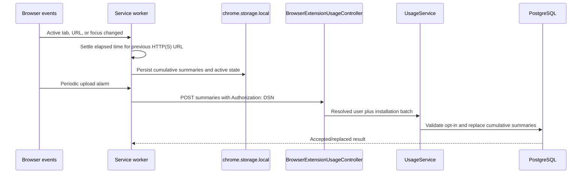
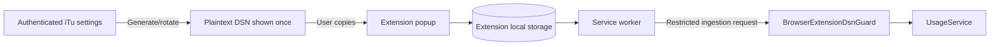

# Browser Extension Architecture

The browser extension is a dependency-free Manifest V3 client for opt-in website-usage collection. It tracks active HTTP(S) tabs, keeps cumulative summaries locally, and uploads them directly to the API with a restricted DSN credential.

[Back to system overview](README.md) · [Extension setup](../../extension/README.md)

## Structure

```text
extension/
  manifest.json               Manifest V3 permissions and entry points
  popup.html, popup.css        Settings and local usage presentation
  popup.js                    Popup events, permission request, rendering
  service-worker.js           Lifecycle, tab/focus observation, uploads
  activity.js                 URL normalization, time accumulation, retention
  test/extension.test.js       Dependency-free behavior tests
```

The extension requests tabs, storage, and alarms. Backend host access is optional and requested only when the user saves a configured API URL.

## Current features

- Explicit opt-in website tracking, disabled by default.
- Active-tab measurement for the focused normal or InPrivate Chromium window.
- URL and hostname normalization for HTTP(S) pages; privileged schemes are ignored.
- Local cumulative daily summaries with a seven-day retry/retention window.
- A popup with connection status, today’s active time, domain-share chart, ranked domains, and URL detail.
- User-configured backend origin with optional host permission requested at save time.
- Rotatable DSN authentication and direct cumulative-summary upload to the API every 30 seconds.
- Offline retention and automatic retry after failed uploads.

The extension does not provide planning, Focus enforcement, website blocking, or general account access.

## Runtime components



[`service-worker.js`](../../extension/service-worker.js) serializes event handling through one operation chain so tab changes, persistence, and uploads do not race. [`activity.js`](../../extension/activity.js) contains the pure normalization, elapsed-time, and pruning rules.

## Collection and upload flow



Uploads are cumulative rather than destructive: local totals remain available for retry and the backend replaces the installation’s matching summary keys. The service worker caps any single elapsed interval and prunes local data outside its retention window.

## Configuration and authentication

The popup saves:

- Whether website tracking is enabled.
- The normalized API base URL.
- A DSN key generated from authenticated iTu settings.
- A random extension installation ID created by the service worker.

The API returns the plaintext DSN only when it is generated or rotated; the server stores its hash. The extension sends `Authorization: DSN <key>` only to `POST /usage/websites/ingest`. This credential is not a bearer login token and cannot access normal user endpoints.



## Privacy and failure behavior

- Tracking is disabled by default and stops accumulating when the setting is off.
- Only normalized HTTP(S) URLs are eligible; credentials and fragments are removed and privileged schemes are ignored.
- InPrivate activity shares the extension process because the manifest uses spanning incognito behavior; the active implementation does not label records as private.
- Loss of focus settles the previous interval and moves tracking to an inactive state.
- Failed uploads retain local cumulative totals and report a disconnected status; the next alarm retries.
- The popup reads local summaries from the service worker and does not query the backend for its chart.

## Current-state compatibility note

The active extension manifest has no native-messaging permission and [`service-worker.js`](../../extension/service-worker.js) does not connect to a native host. Website summaries travel directly from the extension to the API.

[`macos/NativeHost`](../../macos/NativeHost) and the macOS compatibility reader remain in the workspace for compatibility with the superseded native-messaging design. Do not route new extension work through them unless the architecture is deliberately changed and the manifest, installation, privacy, and migration story are updated together.

## Reading the flow

Start with [`manifest.json`](../../extension/manifest.json), then read [`service-worker.js`](../../extension/service-worker.js) alongside [`activity.js`](../../extension/activity.js). Follow ingestion into [`usage.controller.ts`](../../api/src/infrastructure/transport/rest/controllers/usage.controller.ts), [`browser-extension-dsn.guard.ts`](../../api/src/infrastructure/transport/rest/guards/browser-extension-dsn.guard.ts), and [`usage.service.ts`](../../api/src/core/application/use-cases/usage.service.ts).
