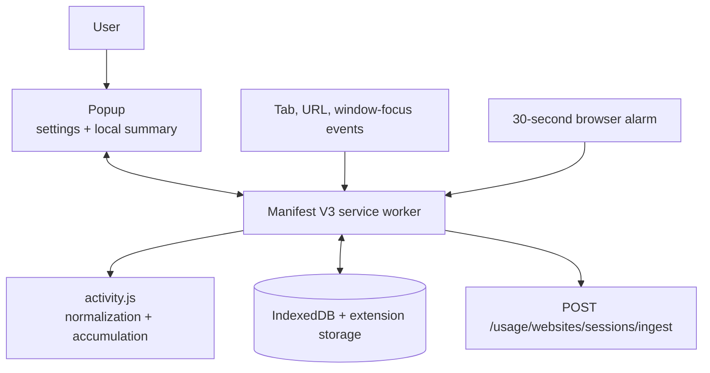
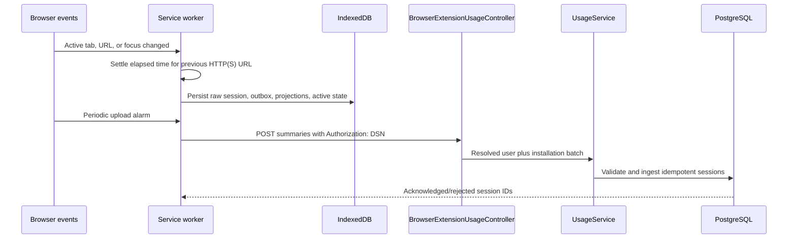
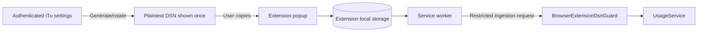

# Browser Extension Architecture

The browser extension is a dependency-free Manifest V3 client for opt-in website-usage collection in Chromium and iOS Safari. It tracks active HTTP(S) tabs, stores raw sessions and projections locally, and uploads them directly to the API with a restricted DSN credential.

[Back to system overview](README.md) · [Extension setup](../../extension/README.md)

## Structure

```text
extension/
  activity.js                 Shared normalization, sessions, persistence
  controller.js               Shared lifecycle, outbox, retry, retention
  chromium-adapter.js         Chromium tabs/windows/alarms adapter
  service-worker.js           Chromium entry point
  safari/                     Safari manifest, adapter, worker, small popup
  test/extension.test.js       Dependency-free behavior tests
```

The extension requests tabs, storage, and alarms. Backend host access is optional and requested only when the user saves a configured API URL.

## Current features

- Explicit opt-in website tracking, disabled by default.
- Active-tab measurement for Chromium and iOS Safari.
- URL and hostname normalization for HTTP(S) pages; privileged schemes are ignored.
- Account-partitioned raw sessions, outbox, and daily projections in IndexedDB.
- A popup with connection status, today’s active time, domain-share chart, ranked domains, and URL detail.
- User-configured backend origin with optional host permission requested at save time.
- Independent default-browser and Safari iOS DSNs with direct session upload to the API.
- Ninety-day retention for acknowledged sessions; unsynced sessions are never age-pruned.
- Offline retention and automatic retry after failed uploads.

The extension does not provide planning, Focus enforcement, website blocking, or general account access.

## Runtime components



[`service-worker.js`](../../extension/service-worker.js) serializes event handling through one operation chain so tab changes, persistence, and uploads do not race. [`activity.js`](../../extension/activity.js) contains the pure normalization, elapsed-time, and pruning rules.

## Collection and upload flow



Uploads contain raw sessions. Acknowledgements remove outbox entries; rejected records retain an error state. The service worker caps any single elapsed interval, drops suspicious stale intervals after restart, and age-prunes only acknowledged raw sessions.

## Configuration and authentication

The popup saves:

- Whether website tracking is enabled.
- The normalized API base URL.
- A DSN key generated from authenticated iTu settings.
- A random extension installation ID created by the service worker.

The API returns the plaintext DSN only when it is generated or rotated; the server stores its hash. The extension sends `Authorization: DSN <key>` only to browser ingest routes. This credential is not a bearer login token and cannot access normal user endpoints.



## Privacy and failure behavior

- Tracking is disabled by default and stops accumulating when the setting is off.
- Only normalized HTTP(S) URLs are eligible; credentials and fragments are removed and privileged schemes are ignored.
- Chromium private activity is labeled separately. Safari private activity is discarded unless the user explicitly enables it; when enabled it is labeled private.
- Loss of focus settles the previous interval and moves tracking to an inactive state.
- Failed uploads retain raw sessions and outbox records for retry.
- The popup reads local summaries from the service worker and does not query the backend for its chart.

## Safari containing app

`ios/iTu.app` embeds `iTuSafariExtension.appex`. A registered iPhone can install the development-signed containing app directly from Xcode; public App Store publication is not required. The native handler exposes API URL, Safari DSN, account/installation identity, and tracking preferences from the existing App Group. It never receives URL streams or session batches.

Safari uses native messaging only to pull configuration. Website sessions travel Safari JavaScript → IndexedDB/outbox → API. Chromium remains manually configured and uses its default-browser DSN; rotating either credential kind leaves the other valid.

## Reading the flow

Start with [`manifest.json`](../../extension/manifest.json), then read [`service-worker.js`](../../extension/service-worker.js) alongside [`activity.js`](../../extension/activity.js). Follow ingestion into [`usage.controller.ts`](../../api/src/infrastructure/transport/rest/controllers/usage.controller.ts), [`browser-extension-dsn.guard.ts`](../../api/src/infrastructure/transport/rest/guards/browser-extension-dsn.guard.ts), and [`usage.service.ts`](../../api/src/core/application/use-cases/usage.service.ts).
