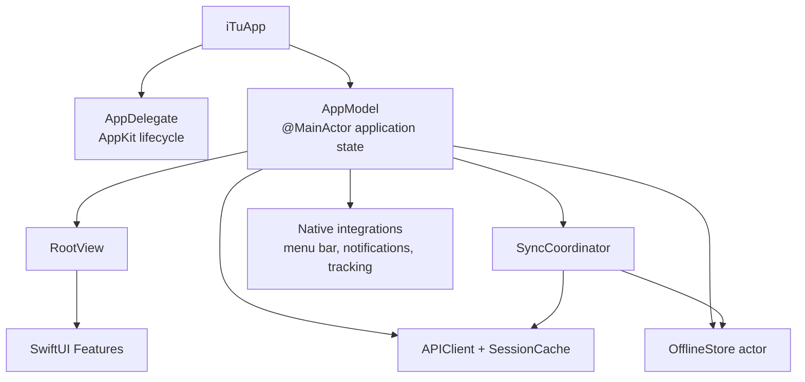
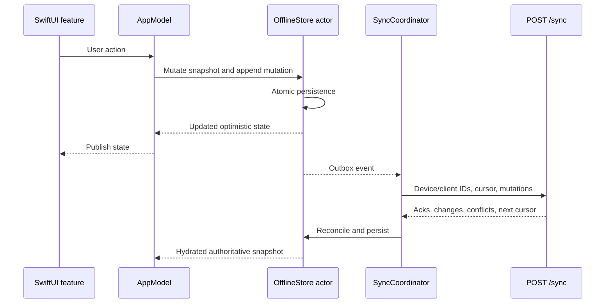
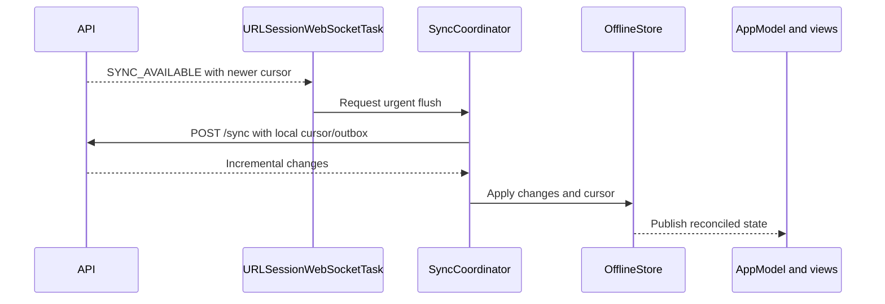
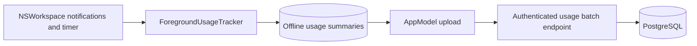

# macOS Architecture

The macOS client is a native SwiftUI application that mirrors iTu concepts while using platform-native windows, menu-bar surfaces, notifications, tracking, and persistence. It shares API and synchronization contracts with the web client, not UI implementation.

[Back to system overview](README.md) · [SwiftUI client guidelines](../swiftui_client_guidelines.md) · [Native roadmap](../../macos/ROADMAP.md)

## Structure

```text
macos/iTu/
  App/
    iTuApp.swift              SwiftUI entry point
    AppDelegate.swift         AppKit lifecycle and auxiliary windows
    AppModel.swift            Shared observable application state
    AppModel+*.swift          Feature-responsibility extensions
    RootView.swift            Authentication/application root
  Features/                   Native feature surfaces by product area
  Shared/
    API/                      APIClient and session cache
    Models/                   Codable transport and view models
    Persistence/              OfflineStore snapshot and feature operations
    Sync/                     SyncCoordinator, hydration, ULIDs
    Tracking/                 Foreground and compatibility website tracking
    UI/                       Theme and shared native controls
macos/iTuTests/               Unit and interaction coverage
macos/NativeHost/             Retained compatibility target
```

The Xcode project uses synchronized root groups, so source files placed under `iTu` and `iTuTests` are automatically included by their targets.

## Current feature surfaces

[`MainView.swift`](../../macos/iTu/Features/Shell/MainView.swift) currently routes to:

- **Home and planning:** Home, Today, Inbox, Upcoming, Completed, Projects, task details, and the Eisenhower Matrix.
- **Focus and Habits:** Focus controls/history and Habit occurrence/progress surfaces.
- **Learning and Growth:** Learn, Flashcard Decks/review, Growth, Shop/Inventory, ledger, and Growth settings.
- **Journal, Budget, and Gym:** dedicated native feature surfaces for each area;
  Journal retains Notes and Weekly Reviews while Budget Transactions and Gym
  Workouts remain separate synchronized entities.
- **Account and operations:** Statistics, notifications, profile, settings, sync conflicts, and recoverable Trash.

Native-only integration surfaces include the menu-bar controller, notification plumbing, Focus policy enforcement, foreground-application tracking, Launch at Login, and the desktop Companion window. Feature directory presence documents a current surface, not guaranteed web parity; use the [native roadmap](../../macos/ROADMAP.md) for verified limitations.

## Application composition



[`iTuApp.swift`](../../macos/iTu/App/iTuApp.swift) creates the app model and root scenes. [`AppDelegate.swift`](../../macos/iTu/App/AppDelegate.swift) owns AppKit-only lifecycle work. [`AppModel.swift`](../../macos/iTu/App/AppModel.swift) is split into `AppModel+*.swift` extensions by responsibility to keep one observable state model without introducing parallel coordinators for each feature.

## API and local state

[`APIClient.swift`](../../macos/iTu/Shared/API/APIClient.swift) owns authenticated REST requests, synchronization, usage endpoints, and WebSocket URL construction. [`SessionCache.swift`](../../macos/iTu/Shared/API/SessionCache.swift) persists authentication material using the native session-storage policy.

[`OfflineStore.swift`](../../macos/iTu/Shared/Persistence/OfflineStore.swift) is an actor holding one Codable offline snapshot. Feature extensions mutate that snapshot, append sync mutations, and write it atomically. The snapshot contains synchronized entities, the outbox, conflicts, and cursor; feature-specific persistence logic stays in `OfflineStore+*.swift`.

## Optimistic write and synchronization



[`SyncCoordinator.swift`](../../macos/iTu/Shared/Sync/SyncCoordinator.swift) serializes flushes, registers the macOS Sync Device, manages retry timing, and maintains the WebSocket connection. [`AppModel+SyncAuth.swift`](../../macos/iTu/App/AppModel+SyncAuth.swift) bootstraps authentication, starts synchronization, exposes conflict recovery, and publishes reconciled store state.

## Invalidation flow



As on web, the socket is only an invalidation channel. The coordinator retrieves data through `POST /sync`.

The native outbox uses the same entity boundaries as Web: `budgettransaction.*`
and `gymworkout.*` mutations do not pass through Journal, and Journal mutations
are limited to retained Notes, Weekly Reviews, tags, templates, Trash, and
revisions. Optional Gym exercise images are queued independently of `/sync`.

## Native usage tracking

[`ForegroundUsageTracker.swift`](../../macos/iTu/Shared/Tracking/ForegroundUsageTracker.swift) observes the frontmost application, excludes inactive system states, and emits local app/day/hour summaries. [`OfflineStore+Usage.swift`](../../macos/iTu/Shared/Persistence/OfflineStore+Usage.swift) persists cumulative summaries; `AppModel` uploads them through authenticated usage endpoints tied to the registered macOS Sync Device.



Tracking is opt-in and controlled by server-backed preferences. Platform collection pauses around locked, sleeping, or inactive states according to the tracker implementation.

Statistics reads server Website Usage Summaries and combines them with pending
local deltas before rendering the native usage views.

## Current-state boundaries

- Native feature parity is not implied by shared models or routes; use the [macOS roadmap](../../macos/ROADMAP.md) for verified coverage.
- The active packaged browser extension uploads URL summaries directly to the API. `macos/NativeHost` and [`WebsiteUsageTracker.swift`](../../macos/iTu/Shared/Tracking/WebsiteUsageTracker.swift) remain compatibility-era code, not the authoritative extension ingestion path.
- Direct REST is still used for operations outside the synchronized entity set.
- `AppModel` and `OfflineStore` extensions split responsibility but remain the same types; do not treat them as independent stores.
- Product date boundaries use the `Asia/Ho_Chi_Minh` Product Calendar while
  instants remain UTC; money values stay decimal rather than floating-point.

## Reading a feature

Start with its view under `Features`, follow calls into the appropriate `AppModel+*.swift` extension, then determine whether the operation mutates `OfflineStore` for synchronization or calls `APIClient` directly. For synchronized work, trace the matching mutation kind through the API sync handler and verify reconciliation in `OfflineStore+Sync.swift`.
