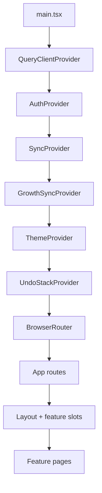
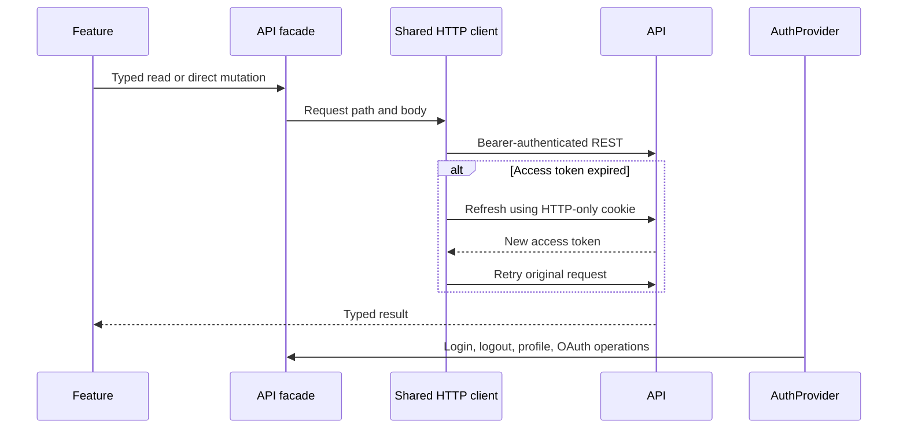
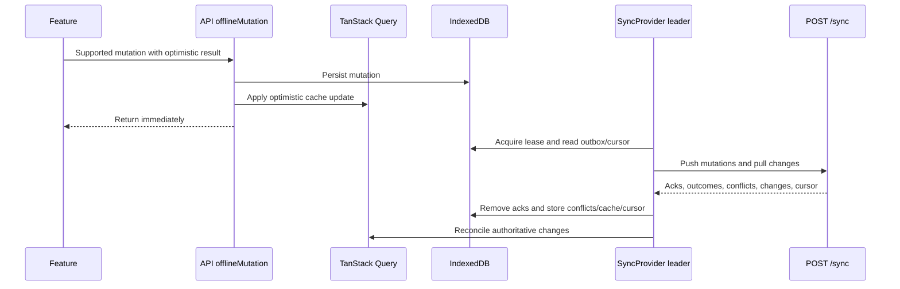
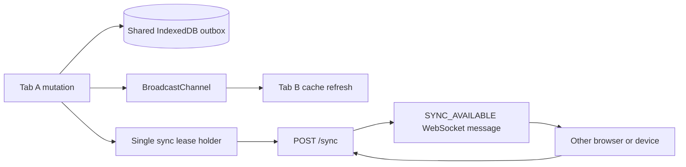

# Web Architecture

The web client is a React/Vite application organized by product feature. TanStack Query owns server state; shared authentication and synchronization providers establish the application-wide transport and offline behavior.

[Back to system overview](README.md) · [Web client guidelines](../web_client_guidelines.md)

## Structure

```text
web/src/
  main.tsx                    Global provider composition
  App.tsx                     Routes and application shell composition
  features/                   Product-owned screens and behavior
  shared/
    api/                      Typed API facade and endpoint groups
    auth/                     Authentication provider and session behavior
    sync/                     IndexedDB store, outbox, reconciliation, sockets
    ui/                       Shared presentation primitives and layout
    browser/                  Safe browser capability wrappers
    hooks/, utils/, constants/
    editor/, markdown/        Shared editing and rendering behavior
  styles/                     Tokens and application styling
```

Feature-specific behavior stays in `features`; behavior shared across product areas belongs in `shared`. [`App.tsx`](../../web/src/App.tsx) composes feature-owned surfaces such as the Planning sidebar and global Focus timer into the shared layout. `Layout.tsx` composes shell navigation, while `SyncStatus.tsx` and `NotificationMenu.tsx` keep sync reconciliation and notification behavior in focused shared surfaces. Growth reward editing keeps pure draft/weight calculations in `growthRewardMath.ts` and the collapsed presentation in `GrowthRewardSummary.tsx`.

Deck details remain feature-local and are composed from focused surfaces:
[`DeckHeader`](../../web/src/features/decks/components/DeckHeader.tsx) owns
deck editing/actions, [`DeckAiCardGenerator`](../../web/src/features/decks/components/DeckAiCardGenerator.tsx)
owns AI streaming and suggestion persistence, and [`DeckCardsPanel`](../../web/src/features/decks/components/DeckCardsPanel.tsx)
owns card search, pagination, and selection presentation. `DeckDetailPage.tsx`
coordinates queries and mutations without moving deck behavior into `shared`.

Focus keeps session and timer mutation ownership in
[`FocusPage.tsx`](../../web/src/features/focus/FocusPage.tsx). The timer dial,
task picker, duration editing, audio controls, and action buttons are composed
by [`FocusTimerCard.tsx`](../../web/src/features/focus/components/FocusTimerCard.tsx);
history browsing and record-edit presentation remain separate feature
components. This keeps Focus policy and cache updates in the page while making
the dense timer surface independently navigable.

Active Gym workouts keep workout queries, mutations, sync conflict handling, and
finish policy in [`ActiveWorkoutPage.tsx`](../../web/src/features/gym/active/ActiveWorkoutPage.tsx).
[`ExercisePickerDialog.tsx`](../../web/src/features/gym/active/ExercisePickerDialog.tsx)
owns exercise-library search, filters, favorites, and custom creation; the
exercise/set editor is composed by
[`WorkoutExerciseList.tsx`](../../web/src/features/gym/active/WorkoutExerciseList.tsx).

Statistics keeps date-range selection and server-query orchestration in
[`StatisticsPage.tsx`](../../web/src/features/statistics/StatisticsPage.tsx),
while `statisticsPeriod.ts` and `statisticsQueries.ts` own the shared period
and query contracts. Overview, trend, Growth, and domain-summary presentation
is split into focused Statistics sections. Foreground application activity and
website activity—including website filter, search, and drill-down state—are
feature-local presentation surfaces in `StatisticsUsageSection.tsx` and
`StatisticsWebsiteUsageSection.tsx`; pure statistics display formatting remains
in `statistics.ts`.

Habits keeps weekly grouping and occurrence actions in `HabitsPage.tsx`.
Creation and editing are feature-local dialog components in `HabitEditor.tsx`
and `HabitDetail.tsx`; shared tag/metric fields and local date projection stay
inside the habits feature, and `HabitDetail` remains the public feature export
used by Today.

Gym's exercise library keeps filtering, selection, and page composition in
`ExerciseLibraryPage.tsx`. Creation/upload state lives in
`CreateExerciseForm.tsx`; editing, archive actions, and performance history
live in `ExerciseInspector.tsx`; metric and image controls are shared only by
those two form surfaces.

Daily journal review keeps query, save, and AI-generation orchestration in
`DailyReviewPage.tsx`. The ledger and AI-insights presentation are isolated in
`DailyReviewLedger.tsx` and `DailyReviewInsights.tsx`; journal behavior and
summary payloads remain unchanged.

Weekly journal review keeps period selection, save, and AI-generation
orchestration in `WeeklyReviewPage.tsx`. Weekly metric aggregation and
comparison presentation live in `WeeklyReviewLedger.tsx`.

Settings keeps section selection and mutation orchestration in
`SettingsPage.tsx`. Usage retention/tracking controls live in
`UsageDataSettings.tsx`; device identity and browser notification permissions
live in `DeviceSettings.tsx`, with permission helpers kept feature-local.

The shared sync layer owns lifecycle, transport, queues, conflicts, persistence,
and generic cache reconciliation. Growth receipt interpretation remains in
[`GrowthSyncBridge.tsx`](../../web/src/features/growth/sync/GrowthSyncBridge.tsx).
Completing a task while it has a matching active Focus WORK session is a server-side
application invariant, so web sync does not coordinate that behavior.

## Current feature surfaces

[`App.tsx`](../../web/src/App.tsx) currently exposes:

- **Home and planning:** Today, Plan, Inbox, Upcoming, Projects, task details, and the Eisenhower Matrix.
- **Focus and Habits:** the Focus workspace, global Focus timer, Habit tracking, occurrence actions, progress, and history.
- **Learning:** Flashcard Decks, deck details, review, and Learning History under the Learn workspace.
- **Growth:** Attributes, Skills, Shop, Inventory-facing actions, ledger, settings, and Growth Receipt overlays.
- **Journal:** Note and Weekly Review browsing/editing, tags/templates,
  attachments, revisions, Trash, and read-only Budget/Gym summaries.
- **Budget:** overview, transactions, budgets/categories, and calendar views.
- **Gym:** overview, active workouts, exercise library, and workout history.
- **Account and operations:** authentication, profile, settings, Statistics, sync/conflict status, and recoverable Trash.

`features/ai` supplies AI-assisted learning behavior rather than a standalone route. Legacy Journal money/gym URLs redirect to the dedicated Budget and Gym workspaces.

Budget Expenses and Gym Workouts are owned by their dedicated feature
surfaces and sync entities; they are not Journal Entry kinds. Journal writes
use the `journal.*`, `journal_attachment.delete`, `journal_revision.restore`,
`journal_template.*`, and `journal_tag.create` mutation kinds through the
shared outbox.

## Application composition



Provider order matters: synchronization consumes authenticated API state and TanStack Query caches; feature routes then consume all three.

## API and authentication

[`client.ts`](../../web/src/shared/api/client.ts) is the stable API facade. Endpoint groups receive the shared request context rather than implementing transport independently. [`httpClient.ts`](../../web/src/shared/api/httpClient.ts) owns the base URL, access token, refresh behavior, timeouts, and authenticated requests.

[`AuthProvider.tsx`](../../web/src/shared/auth/AuthProvider.tsx) stores the user profile in safe local storage, but the access token remains in the API client’s runtime state. Refresh uses the server-managed cookie; logout clears both local identity and the in-memory token.



## State ownership

| State | Owner |
| --- | --- |
| Server query results | TanStack Query |
| Supported optimistic entities | TanStack Query plus durable IndexedDB cache |
| Pending mutations and conflicts | IndexedDB `OfflineSyncStore` |
| Sync cursor and cross-tab lease | IndexedDB `OfflineSyncStore` |
| Authenticated user identity | `AuthProvider` plus safe local storage |
| Access token | Shared HTTP client memory |
| Forms and temporary interaction | Feature-local React state |

Do not add another application state store for data already owned by these layers.

## Offline-first mutation flow

[`SyncProvider.tsx`](../../web/src/shared/sync/SyncProvider.tsx) installs the offline mutation handler used by the API facade. [`syncQueue.ts`](../../web/src/shared/sync/syncQueue.ts) coordinates queue lifecycle and transport, while [`syncQueuePolicy.ts`](../../web/src/shared/sync/syncQueuePolicy.ts) keeps retry, conflict, cursor, and coalescing rules pure. [`offlineStore.ts`](../../web/src/shared/sync/offlineStore.ts) provides IndexedDB durability and the cross-tab synchronization lease.



Unsupported or explicitly online operations use a direct REST fallback. The offline mutation input therefore includes both the optimistic value and the online fallback; features should call the API facade rather than the sync endpoint directly.

Shared sync owns lifecycle, transport, queues, conflicts, persistence, and
generic cache reconciliation. Product interpretation belongs to the owning
feature. For example, Planning owns task behavior and Growth owns Growth
receipts; the sync layer does not decide feature business policy.

## Planning and Calendar composition

[`PlanningPage.tsx`](../../web/src/features/planning/PlanningPage.tsx) is a
composition root over `PlanningHeader`, `PlanningComposer`,
`PlanningBulkActions`, and `PlanningTaskWorkspace`. Task queries, selection,
ordering, and grouping remain Planning-owned hooks and pure functions. The
page coordinates those pieces with the existing task detail/context surfaces;
it does not own the implementation of each concern.

[`MatrixPage.tsx`](../../web/src/features/planning/MatrixPage.tsx) composes
matrix data, selection, ordering, toolbar/dialog controls, and the
[`MatrixTaskGrid.tsx`](../../web/src/features/planning/components/MatrixTaskGrid.tsx)
surface. [`CalendarTimeline.tsx`](../../web/src/features/calendar/components/CalendarTimeline.tsx)
coordinates timeline state while Day/Week/Month view pieces live in
`CalendarTimelineViews.tsx`. The existing task, calendar, drag, and resize
algorithms remain feature-local and unchanged.

## Cross-tab and cross-device refresh



[`syncIdentity.ts`](../../web/src/shared/sync/syncIdentity.ts) gives a browser installation a stable device ID and each tab a separate client instance ID. [`syncWebSocketClient.ts`](../../web/src/shared/sync/syncWebSocketClient.ts) reconnects the invalidation channel. BroadcastChannel coordinates sibling tabs; WebSockets coordinate separate connections and devices.

## Reading a feature

1. Start at the route in [`App.tsx`](../../web/src/App.tsx).
2. Follow the page into its `features/<area>` queries and mutations.
3. Follow API calls through [`client.ts`](../../web/src/shared/api/client.ts) to the endpoint group.
4. If it calls `offlineMutation`, inspect the cache reconciliation in [`syncCache.ts`](../../web/src/shared/sync/syncCache.ts) and the matching API mutation handler.
5. Keep reusable UI in `shared/ui`, but keep product decisions in the feature or API use case that owns them.

## Current-state boundaries

- Offline support is entity-specific; the existence of `SyncProvider` does not make every REST mutation offline-capable.
- TanStack Query remains authoritative for rendered server state even when IndexedDB persists a dehydrated cache.
- WebSocket payloads are invalidations only and must not be treated as authoritative entity data.
- Browser-extension tracking is configured from web settings but runs independently of the web client.
- Money is transported as decimal strings; product date boundaries use the
  `Asia/Ho_Chi_Minh` Product Calendar while instants remain UTC.

Feature-to-feature imports are migration-sensitive: new consumers should use a
feature's public root export instead of reaching into another feature's
implementation files. Existing deep imports are reported by the architecture
check until their ownership is clarified.
