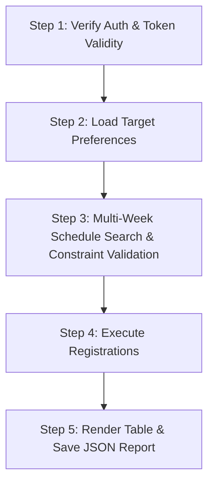

# TalkFirst Course Finder & Auto-Registrar — `tools/cloudflare-bypass`

A clean, modular auto-registration engine for TalkFirst written in TypeScript with strict type definitions, centralized constants, prioritized guard clauses, interval background auto-sync, and multi-week scheduling capabilities. It manages authentication, searches multi-week schedules for your preferred courses, validates availability, enforces constraints (conflict, capacity, weekly quotas), registers open slots, and generates an audit report.

---

## 🛡️ Smart Validation & Scheduling Rules

Before registering any course, the engine validates all candidate slots against 4 strict safety rules:

| Check | Status | Description |
|---|---|---|
| **1. Existing Enrollment & Duplicate Topics** | `📌 ALREADY ENROLLED` / `🔁 DUPLICATE CLASS` | Flags if you have already registered for this exact class or topic, or if multiple classes with the same name/topic are selected in the same batch. |
| **2. Seat Capacity** | `🚫 CLASS FULL` | Flags if `currentStudents >= maxStudents` (no open seats remaining). |
| **3. Time Overlaps** | `⚠️ TIME CONFLICT` | Flags if the class overlaps with any other class you are already enrolled in, or another class planned in the same batch. |
| **4. Program Quotas** | `🛑 QUOTA EXCEEDED` | Uses the API's `summary` quota data to ensure you don't exceed weekly limits (e.g. max **2 Main Classes/week**, max **2 Free-Talk Classes/week**). |

---

## 🏗️ Architecture & `src/` Layout

```
tools/cloudflare-bypass/
├── src/
│   ├── constants.ts            # Central constants, DOM selectors, timeouts, routes, and status badges
│   ├── types.ts                # TypeScript interfaces and contracts for auth, schedules, criteria, and reports
│   ├── pre-register.ts         # Interactive visual timetable web UI & JSON persistence server (Hono)
│   ├── classes-manager.ts      # Schedule cache manager for classes.json persistence
│   ├── enrolled-classes-manager.ts # Enrolled classes persistence and Teacher Report aggregator
│   ├── enrolled-classes.ts     # CLI orchestrator for student registered list and teacher teaching reports
│   ├── ui/
│   │   ├── index.html          # Interactive timetable frontend matching TalkFirst dark calendar
│   │   ├── app.js              # Alpine.js controller with interval background auto-sync and delta patching
│   │   └── styles.css          # Dark calendar stylesheet & animations
│   ├── auto-register.ts        # Main orchestrator (5-step pipeline: Auth -> Load -> Match -> Register -> Report)
│   ├── browser-registrar.ts    # Chrome CDP UI registrar & canceller with automated Turnstile solving
│   ├── api-client.ts           # TalkFirst HTTP API client (token validation, 401 retry, schedule fetch, enrolled list)
│   ├── token-manager.ts        # Local JWT token storage & expiration decoder (.tokens.json)
│   ├── course-matcher.ts       # Matching engine, conflict detector, quota manager, and guard checks
│   └── bypass.ts               # Browser login helper via Chrome CDP
├── classes.json                # Cached schedule data across all fetched weeks
├── enrolled-classes.json       # Persisted student enrolled classes data
├── teacher-classes-report.md   # Generated Markdown report of teachers and their classes
├── teacher-classes-report.json # Generated JSON report of teachers and their classes
├── courses.json                # Selected target courses configuration
├── tsconfig.json               # TypeScript configuration with strict checks
├── package.json
└── README.md
```

---

## 🔄 5-Step Pipeline Execution Flow



1. **Step 1 (`step1_verifyAuthentication`)**: Reads `.tokens.json` and auto-refreshes `accessToken` if nearing expiration.
2. **Step 2 (`step2_loadTargetCourses`)**: Loads and validates your course preferences from a JSON file.
3. **Step 3 (`step3_buildRegistrationPlan`)**: Queries TalkFirst schedule across current & next week, matching criteria (lesson, teacher, day/date, time, room, type) and enforcing the 4 validation rules.
4. **Step 4 (`step4_executeRegistrations`)**: Automatically navigates to `/my-schedule/` in Chrome via CDP, hovers the target class card, clicks "REGISTER", solves Cloudflare Turnstile, and confirms registration.
5. **Step 5 (`step5_generateAndSaveReport`)**: Prints formatted summary table and persists `last-registration-report.json`.

---

## 🚀 Usage

```bash
cd tools/cloudflare-bypass

# 1. Typecheck the codebase
yarn typecheck
# or:
tsc --noEmit

# 2. Launch Interactive Timetable Web UI with Hot-Reload (Development)
yarn dev

# 3. Launch Interactive Timetable Web UI (Using classes.json cache for instant startup)
yarn pre-register

# 4. Launch UI & force bypass / sync latest classes from TalkFirst API
yarn pre-register:bypass
# or:
npx tsx src/pre-register.ts --bypass

# 5. Launch UI strictly offline using classes.json
yarn pre-register:offline
# or:
npx tsx src/pre-register.ts --offline

# 6. Automatically register target courses for NEXT week (default)
yarn start
# or explicitly:
npx tsx src/auto-register.ts --week next

# 7. Automatically register target courses for THIS week
yarn start:this
# or with CLI argument:
npx tsx src/auto-register.ts --this-week

# 8. Dry-run validation check only (without submitting registration)
yarn dry-run
# or for this week:
yarn dry-run:this
# or with CLI flag:
npx tsx src/auto-register.ts --dry-run

# 9. Check active token expiration and login status
yarn status

# 10. Manually trigger token refresh
yarn refresh

# 11. Fetch current week's enrolled classes and generate teacher report
yarn enrolled
# or for this week explicitly:
yarn enrolled:this
# or for next week:
yarn enrolled:next

# 12. Generate and display teacher teaching report from cached data
yarn teachers
# or:
yarn enrolled:offline
```

---

## 📝 Course Input Schema (`courses.json`)

You can pass the full TalkFirst course object directly copied from the schedule/API:

```json
[
  {
    "id": "019fe0df-e634-7921-898e-548e2addcea5",
    "timeSlot": "019b11f8-382f-7a0b-b275-1255e6394719",
    "programClassId": "019b08a3-b490-7c6c-bd25-d7d11e1c4c35",
    "date": "2026-08-16",
    "teacherName": "Phạm Quế Phương",
    "teacherNickName": "Quế Phương",
    "startTime": "08:50:00",
    "endTime": "10:20:00",
    "room": "Ground",
    "lesson": "Voice Inflection"
  }
]
```
